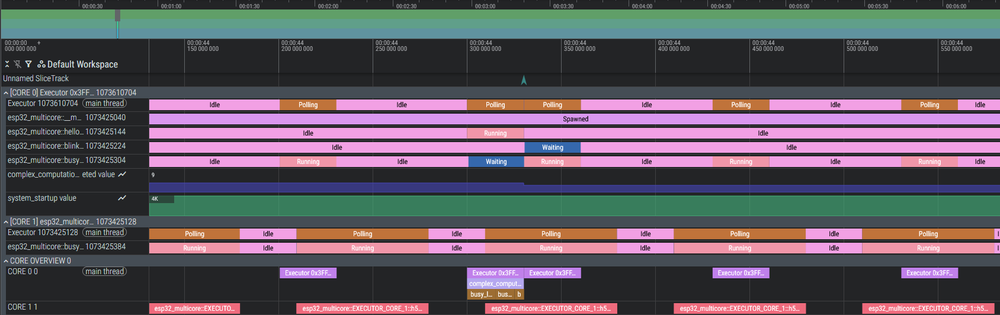

# RustMeter

**RustMeter** is a comprehensive profiling, tracing, and monitoring system designed specifically for **Embedded Rust** applications. It is highly integrated with the [Embassy](https://github.com/embassy-rs/embassy) async framework and leverages [defmt](https://github.com/knurling-rs/defmt) for efficient data transmission.

The collected data is converted into a format that can be directly visualized in the **[Perfetto UI](https://ui.perfetto.dev/)**, providing detailed insights into runtime behavior, task scheduling, and firmware performance.



## ✨ Features

- **Embassy Task Tracing:** Automatically visualizes the lifecycle of async tasks (Spawned, Waiting, Running, Preempted, Idle).
- **Function Monitoring:** Simple macro `#[monitor_fn]` to measure execution times of synchronous and asynchronous functions.
- **Scoped Tracing:** Granular measurement of specific code blocks within functions using `monitor_scoped!`.
- **Custom Metrics:** Record values over time (e.g., sensor data, memory usage) using `event_metric!`.
- **Multicore Support:** Detects and visualizes events separated by processor cores (e.g., ESP32 App/Pro CPU).
- **Host CLI:** A wrapper around `cargo run` that filters and parses logs to generate a trace file while still displaying normal logs.

## 📦 Project Structure

The repository consists of two main components:

1.  **`rustmeter-beacon`**: The library (crate) included in your embedded firmware. It provides macros and hooks for `embassy-executor`.
2.  **`rustmeter-cli`**: The command-line tool for the developer PC. It runs the project, collects tracing data, and creates the JSON file for Perfetto.

## 🚀 Installation & Setup

### 1. Install CLI

Install the host tool locally:

```bash
cargo install rustmeter-cli
```

### 2. Prepare Embedded Project

Add rustmeter-beacon to your firmware's dependencies and enable the `trace` feature of `embassy-executor` (Cargo.toml):

```toml
[dependencies]
rustmeter-beacon = { version = "X" } # Adjust path accordingly
defmt = "1"

# IMPORTANT: Enable the `trace` feature of embassy-executor!
embassy-executor = { version = "X", features = [, "trace"] }
```

**Attention**: Ensure that `defmt` with `rtt` is already set up in your project, as `rustmeter-beacon` relies on it for logging. All defmt logs need a timestamp. So make sure you defmt ist configured properly with a timer source (See [defmt documentation](https://defmt.ferrous-systems.com/timestamps) for more details).

### 3. Add Instrumentation

Import the crate in your main.rs to activate the trace hooks:

```rust
use rustmeter_beacon::*;
```

## 🛠️ Usage

### Monitor Functions

Use the #[monitor_fn] attribute to automatically track a function:

```rust
#[monitor_fn] // Name is automatically inferred
async fn process_sensor_data() {
    // ... complex calculation
}

#[monitor_fn("CustomName")] // Custom name for the trace
fn irq_handler() {
    // ...
}
```

### Monitor Code Blocks

For finer measurements within functions, use monitor_scoped!:

```rust
fn calculate() {
    let result = monitor_scoped!("MatrixMult", {
        // Time-intensive calculation here
        matrix_a * matrix_b
    });
}
```

### Record Metrics

Record value trends, which are displayed as a counter graph in Perfetto:

```rust
let temperature = sensor.read();
event_metric!("temperature_celsius", temperature);
```

### Start Tracing

Navigate to your embedded project directory and start it with rustmeter instead of cargo run:

```bash
# Debug Build
rustmeter

# Release Build
rustmeter --release
```

You should see your normal defmt logs in the terminal. Press Ctrl+C to stop recording. A trace file should appear in the current directory.

**Attention**: If you encounter flooding logs in your terminal starting with "@EVENT...", ensure that your defmt logger is correctly configured with timestamps, as rustmeter relies on them for proper parsing.

## Analysis

1. After stopping, you will find a file named `rustmeter-perfetto-debug.json` (or `-release.json`) in your directory.

2. Open ui.perfetto.dev in your browser

3. Click on "Open trace file" and select the generated JSON file

You will now see a timeline containing:

- All CPU cores

- The Embassy Executors and their status (Idle/Polling)

- Individual tasks and their states (Running, Waiting, Preempted)

- Your custom function calls and metrics

## Troubleshooting

- **Log Flooding**: If you see excessive logs starting with "@EVENT...", double-check your defmt configuration to ensure timestamps are enabled.
- **Missing Embassy Events**: If certain events are not appearing in the trace, ensure that the `trace` feature is enabled for `embassy-executor` in your Cargo.toml.
- **Performance Issues**: While RustMeter is designed to be lightweight, excessive instrumentation may impact performance. Use monitoring macros judiciously in performance-critical sections.
- **No Data in Perfetto**: If the generated JSON file does not contain expected data, verify that your embedded application is running and generating events during the tracing session. rustmeter-beacon uses defmt::info!. Ensure your log level is set appropriately to capture these events.

## 🤝 License

This project is licensed under the MIT License. See LICENCE for details.

## TODOs

- [ ] Add more examples and documentation
- [ ] Support more embedded platforms and architectures (currently tested on ESP32. Planned: RP2040, STM32)
- [ ] Include RTOS Tracing suport (e.g. ESP-RTOS)
- [ ] Implement advanced filtering and analysis features in rustmeter (CPU usage, memory consumption, etc.)
- [ ] Optimize performance and reduce overhead further
- [ ] Add CI/CD for automated testing of core functionality
- [ ] Create an own book documentation site for better user guidance

Note: This tool is still under development. APIs are subject to change.
